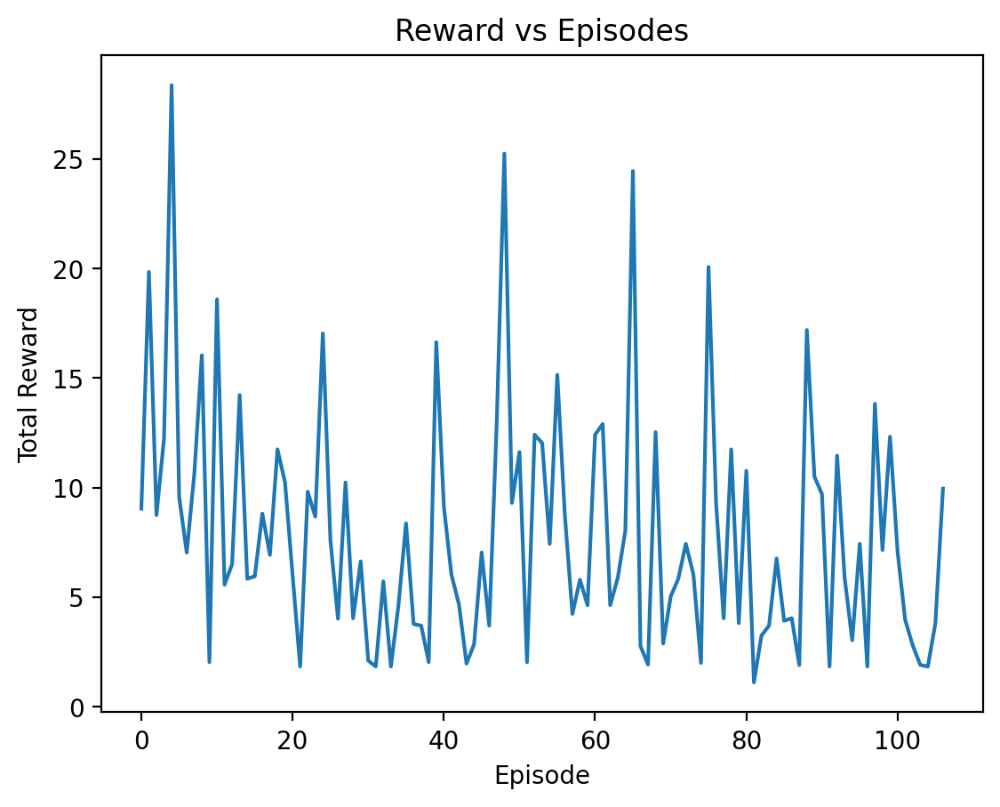

# Autonomous Driving with Deep Q-Networks

**Author:** Melis Kurşun  
**Course:** Intro to Artificial Intelligence – Applied Reinforcement Learning

## 🎥 Evolution of Learning
https://github.com/user-attachments/assets/b9dad784-5c58-44fd-abff-83a3f9edf9e4

## 🧠 Methodology

### Environment
Highway-env autonomous driving environment.

### State Space
The agent observes a numerical representation of the ego vehicle and nearby vehicles, including relative positions, speeds, and lane information.

### Action Space
The agent can choose from discrete actions such as maintaining speed, accelerating, decelerating, and changing lanes left or right.

### Reward Function
$$
R = w_s \cdot v - w_c \cdot \mathbb{1}_{collision}
$$

The reward function is designed to balance speed and safety. The agent is positively rewarded for maintaining higher speeds, encouraging efficient driving, while collisions are heavily penalized to enforce safe behavior. This formulation reflects the multi-objective nature of autonomous driving, where both performance and safety are critical.

### Algorithm
We use Deep Q-Networks (DQN), which extend classical Q-learning by approximating the action-value function with a deep neural network. This allows the agent to scale to larger state spaces while following the value-based reinforcement learning framework introduced in the course.

### Neural Network Architecture
The Q-function is approximated using a multilayer perceptron (MLP) consisting of fully connected layers that take the state representation as input and output Q-values for each discrete action.

### Hyperparameters
Key hyperparameters include the learning rate, discount factor (gamma), replay buffer size, batch size, and exploration rate for the ε-greedy policy. These parameters were chosen to ensure stable learning while allowing sufficient exploration in the dynamic traffic environment.

## 📈 Training Analysis

The training curve shows a gradual increase in total episode reward as training progresses, indicating that the agent begins to learn safer and more efficient driving behavior. Fluctuations in reward are expected due to exploration, especially in the early stages of training.

## ⚠️ Challenges & Failures
During training, the agent initially learned unsafe behaviors such as frequent lane changes, leading to collisions. This issue was mitigated by adjusting the reward function to penalize collisions more strongly, which encouraged safer driving strategies.

## 📁 Repository Structure
The repository is organized into separate folders for source code (src), utility scripts (utils), training plots (plots), and recorded videos (videos). This modular structure improves readability, reproducibility, and ease of experimentation.

